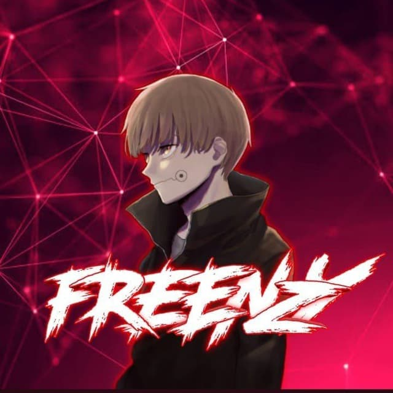
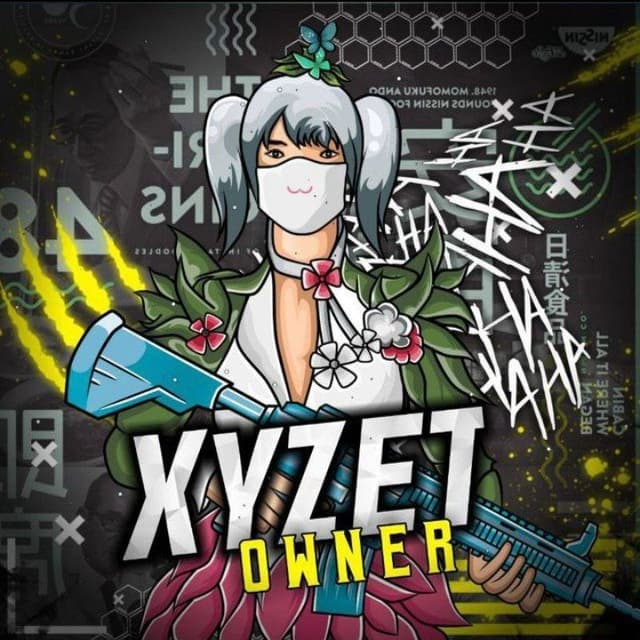

<a 

<!-- <h1>ANONYMOUS CHAT BOT</h1> -->

## We Need its Before Start
- Install node js ( <a href="https://nodejs.org/en/download/">Download Here</a> )
- clone this repo ( git clone https://github.com/MRHRTZ/Anon-Chat )
- Goto this directory ( cd Anon-Chat )
- 
## Lets Installation And Start!
- Install It ( npm i )
- Run ( npm start )

## Note
- You Can change Owner Number on settings.js
- and make sure your node js v14!

## if u have a bug! Contact me!
- <a href="https://wa.me/6285283200715?text=bug report">WhatsApp</a>
- <a href="https://www.instagram.com/frenzy.apk">Instagram</a>
